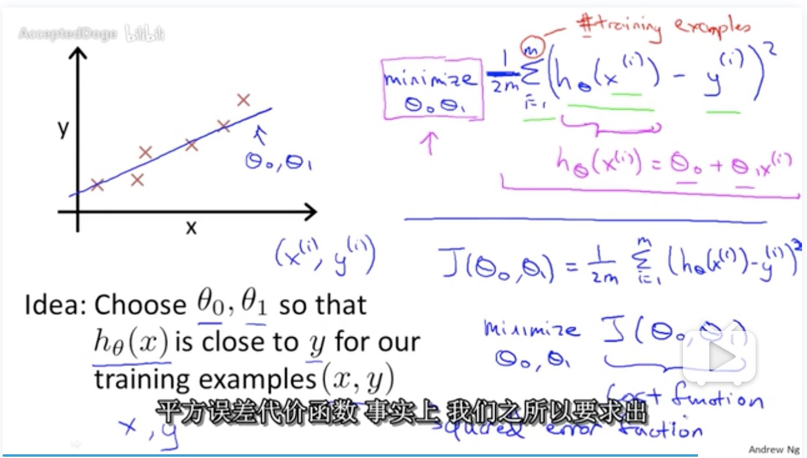
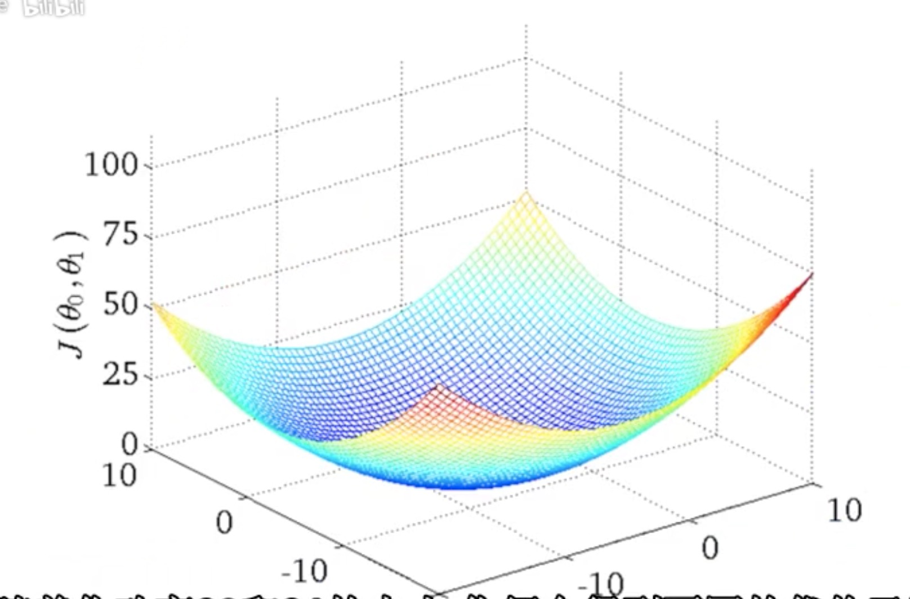

# 笔记: 机器学习 (Machine Learning)
 
[机器学习（Machine Learning）- 吴恩达（Andrew Ng）_哔哩哔哩 (゜-゜)つロ 干杯~-bilibili](https://www.bilibili.com/video/av9912938)

Machine Learning (机器学习): 
- Grew out of work in AI
- New capability for computers

Examples:
- Database mining (数据挖掘)
- Application can't program by hand. 
   - 自动驾驶
   - 手写识别
   - NLP
   - Computer Vision (机器视觉)
   - 推荐机制
   - 垃圾邮件分类 (无数人点击Spam让机器学习到什么是垃圾邮件)
- Self-customizing programs

## What is Machine Learning?

Arthur Samuel (1959)

> Field of study that gives computers the ability to learn without being explicitly programmed. (在进行特定编程的情况下给予计算机学习能力的领域)

Samuel写了一个下棋的程序, 这程序神奇之处在于他自己不是一个下棋高手,  但他通过编程让程序自己跟自己写了上万盘棋， 通过观察那种策略会赢, 一段时间后, 程序就自己学会了什么是好的策略. 最终, 程序自己学会了下棋。而且下棋水平超过了Samuel本人, 这绝对是令人瞩目的成果。

Tom Mitchell(1998)

> Well posed Learning Problem: A computer program is said to learn from experience E with respect to some task T and some performance measure P if its performance on T, as measured by P, improves with experience E. (一个程序被认为能从经验E中学习解决任务T, 达到性能度量值P, 当且仅当, 有了经验E后, 经过P评判, 程序在处理T时的性能有所提升)

以刚才下棋程序为例
- 经验E: 程序上万次的自我练习的经验
- 任务T: 下棋
- 性能度量值P: 与新的对手比赛时赢的概率

Machine learning algorithms:
- Supervised learning (监督学习) 我们将教会计算机如何去完成任务
- Unsupervised learning (无监督学习) 我们打算让它自己进行学习

## Supervised learning
> The term supervised learning refers to the fact that we gave the algorithm a data set in which the "right answers" were given.

给一个算法一些已知确定的数据集, 比如之前一年每天的天气状况, 或者之前的房价数据集, 算法的目的就是计算出更多不在已知数据集中的结果。

监督学习也叫做回归问题 （regression problem), 表示要预测一个连续值(continuous value)的输出, 比如房价, 温度, 就是一个数值, 或者说标量(scalar value)。

- boolean是离散值
- integer是连续值

Classification (分类) 预测一个离散值输出。

举例:
判断肿瘤良性和恶性
- 给定一组输入
- 这是一个分类问题
- 肿瘤大小是一个特征(feature), 我们会通过多个特征来判断, 比如age

一个学习算法会用到更多的特征和属性。

## Unsupervised Learning
也会给一堆数据集, sample, 但是没有对应的"right answer"
- 聚类问题: google对新闻进行分类, 包括推荐机制

个人理解就是:
- 监督就是给出一组有答案的数据, 让程序去推导出正确答案
- 无监督是给出一组数据, 每个数据也没有所谓的答案, 需要程序运用算法分析判断他们, 实现分类聚合等操作

Cocktail party problem
声音分离

本教程采用Octave开源语言, Octave内置了很多算法, 一般用Octave构建算法原型, 验证后再用Java或者C++实现。

## Model Representation
第一个算法: 线性回归算法 (Linear Regression)

利用称为线性回归方程的最小平方函数对一个或多个自变量和因变量之间关系进行建模的一种回归分析。

- m: Number of training examples
- x's = "input" variable / features
- y's = "output" variable / "target" variable

one training example(one row): (x, y)

Training Set
- (2104, 460)
- (1416, 232)
- (1534, 315)
- (852, 178) 

整个过程:
- Training Set
- Learning Algorithm
- h (hypothesis 假设, 表示一个function) h(x)=y， h其实就表示一个模型
- model: 线性回归(linear regression)模型就是一个最简单的模型

## Cost Function (代价函数)
找到最有可能的直线与我们的数据相拟合。

**Hypothesis (假设)**

$$h_\theta(x)=\theta_0+\theta_1x$$

**Parameters**

- $$\theta_0$$: 斜率
- $$\theta_1$$: 起始点

**Cost Function**

$$\sum_{i=1}^{m} (h_\theta(x^{(i)})-y^{(i)})^2$$

**Goal**

$$minimize J(\theta_0, \theta_1)$$

现在就来求这个cost function的minimize(最小值), 代价函数也被称为平方误差函数(squared error function)

这里一定要看视频, 关于cost function的3个chapter非常精彩, 通过$$\theta_1=0$$来简化时, $$J(\theta_0)$$的图像就是一个二次曲线, 底部为0时误差最小, 但如果同时考虑两个参数就形成了一个三维曲面, 曲面的最底部即误差最小值。

## Gradient descent (梯度下降)

构思:
1. Start with some $$\theta_0, \theta_1$$.初始化$$\theta_0$$和$$\theta_1$$, 比如都初始化为0
2. Keep changing $$\theta_0, \theta_1$$ to reduce $$J(\theta_0, \theta_1)$$, 直到找到最小值

repeat until convergence {

$$\theta_j := \theta_j - \alpha\frac{\partial}{\partial\theta_j}J(\theta_0,\theta_1)$$  (for j = 0 and j= 1)

}

- $$\alpha$$: learning rate

## Gradient Descent Intuition

## Matrices and Vectors

# EOF

