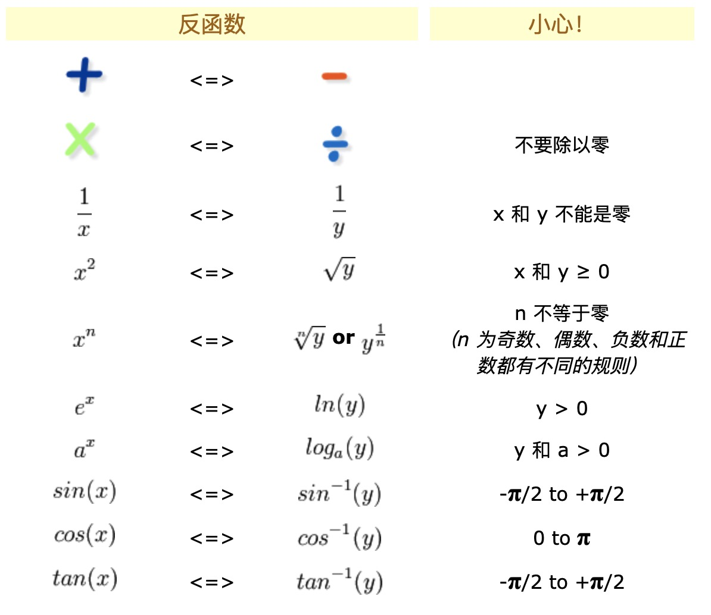

# 微积分 (calculus)

## 函数、图像和直线

函数是将一个对象转化为另一个对象的规则, 起始对象称为输入(input), 来自称为定义域(domain)的集合, 返回对象称之为输出, 来自称为上域(codomain)的集合。

$$f(x)=x^2$$
- f 是变换规则, 是一个函数(function), f 能将input变换为output
- f(x) 意味着这个变换规则应用于变量x后得到的结果
- 定义域: 输入值的范围
- 一个输入必须给每一个有效的输入指定唯一的输出

### 反函数 (Inverse Function)

$$f(x)=2x+3$$ 与之对应的反函数的逻辑就是对输入先减3后除2, 即 $$f^{-1}(y)=\frac{y-3}{2}$$

$$f(x)=x^2$$ 对应就是 $$f^{-1}(y)=\sqrt{y}$$

换句话说, x经过$$f$$得到y, y经过$$f^{-1}$$再次得到x。

常见的相反关系如:

## 三角函数

## 极限

## 连续性和可导性

## 微分

## 导数