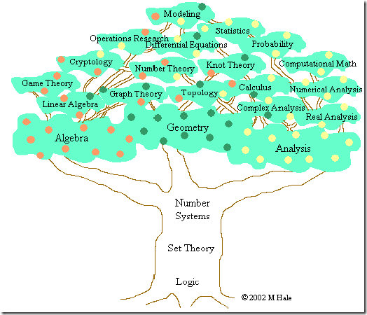

# 数学基础

维基百科英语定义

> Mathematics (from Greek μάθημα máthēma, "knowledge, study, learning") includes the study of such topics as quantity (number theory), structure (algebra), space (geometry), and change (mathematical analysis). It has no generally accepted definition.

这个定义要比维基百科中文清楚不少, 提到4大主题:

- Quantity (number theory): 数量, 对应的是"数论"

  - 自然数 (Natural numbers) $$\mathbb{R}$$: $$1, 2, 3$$
  - 整数 (Integers) $$\mathbb{Z}$$: $$-2, -1, 0, 1, 2$$
  - 有理数 (Rational numbers) $$\mathbb{Q}$$: $$-2, \frac{2}{3}, 1.21$$
  - 实数 (Real numbers) $$\mathbb{R}$$: $$-e$$, $$\sqrt{2}$$, 3, $$\pi$$
  - 复数 (Complex numbers) $$\mathbb{C}$$: $$2$$, $$i$$, $$-2+3i$$
  - 超限数 (Infinite cardinals)

- Structure (algebra): 结构, 对应的是代数

  个人理解代数就是用符号(变量)代替具体数字, 不再研究具体数字, 而是研究各种抽象化的结构, 比如$$f(x)=x+1$$, 我们并不关心$$x$$到底是几, 而是关心$$f$$这个模型的结构。

  其中包括了:
  - 组合数学 (Combinatorics)
  - 数论 (Number theory)
  - 群论 (Group theory)
  - 图论 (Graph theory)
  - 序理论 (Order theory)
  - 代数 (Algebra)

- Space (geometry): 空间, 对应的是几何

  空间的研究源于几何学--尤其是欧几里得几。三角学则结合了空间及数, 且包含了著名的勾股定理。现今对空间的研究更推进到了更高维的几何、非欧几里得几何及拓扑学。数和空间在解析几何、微分几何和代数几何中有着很重要的角色。

  - 几何 (Geometry)
  - 三角学 (Trigonometry)
  - 微分几何 (Differential geometry)
  - 拓扑学 (Topology)
  - 分形 (Fractal geometry)
  - 测度论 (Measure theory)

- Change (mathematical analysis): 变化, 对应的是数学分析
  
  了解及描述变化在自然科学里是一普遍的议题，而微积分学更为研究变化的有利工具。函数诞生于此，做为描述一变化的量的核心概念。对于实数及实变函数的严格研究为实分析，而复分析则为复数的等价领域。

  - 微积分 (Calculus)
  - 矢量分析 (Vector calculus)
  - 微分方程 (Differential equations)
  - 动力系统 (Dynamical systems)
  - 混沌理论 (Chaos theory)
  - 复分析 (Complex analysis)

大体可以分为以下3类:
- Pure mathematics (纯粹数学, 纯数学): 包括数量, 结构, 空间, 变化。
- Applied mathematics (应用数学): 应用数学思考将抽象的数学工具运用在解答科学、工商业及其他领域上之现实问题。主要包括: 统计学, 统计学, 计量金融, 生物数学, 物理数学, 数值分析等。
- Discrete mathematics (离散数学): 是数学的几个分支的总称, 研究基于离散空间而不是连续的数学结构。主要包括: 数理逻辑, 集合论, 信息论, 数论, 组合数学, 图论, 抽象代数, 理论计算机科学, 拓扑学, 运筹学, 博弈论等。

> 现代数学有数不清的分支，但是，它们都有一个共同的基础——集合论——因为它，数学这个庞大的家族有个共同的语言。集合论中有一些最基本的概念：集合(set)，关系(relation)，函数(function)，等价 (equivalence)，是在其它数学分支的语言中几乎必然存在的。对于这些简单概念的理解，是进一步学些别的数学的基础。我相信，理工科大学生对于这些都不会陌生。

在集合论的基础上，现代数学有两大家族: 分析(Analysis)和代数(Algebra)。

- 代数(Algebra)包括了初等代数、抽象代数(abstract algebra)和线性代数(linear algebra)。
- 分析(Analysis)则是建立在极限(limits)的基础上, 最主要的就是微积分的研究。

事实上, 对于CS来说, 也恰恰就是线性代数和微积分这两个概念。

参考:
- [MIT牛人解说数学体系 | P.Linux Laboratory](http://www.penglixun.com/study/science/mit_math_system.html)
- [代数结构入门：群、环、域、向量空间 | | Spark & Shine](http://sparkandshine.net/algebraic-structure-primer-group-ring-field-vector-space/)